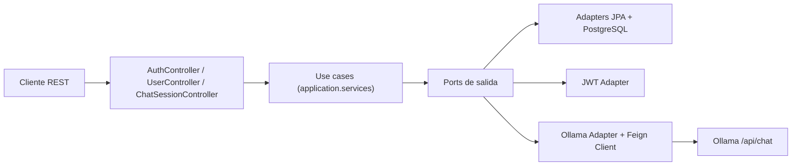
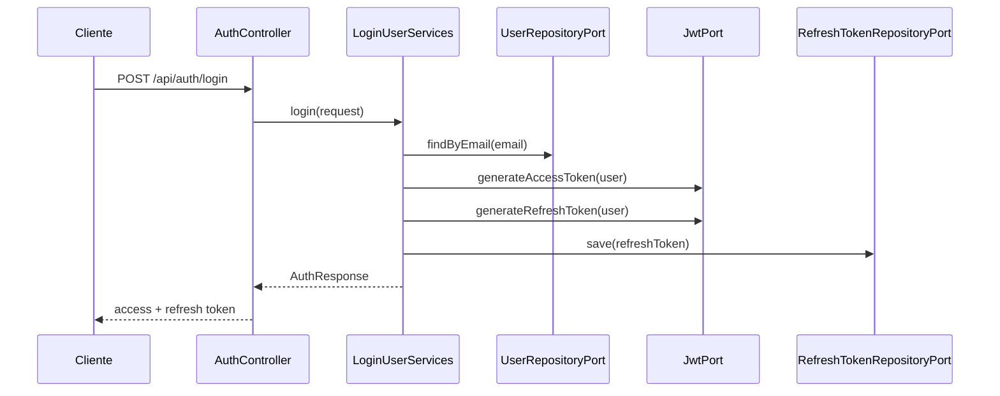
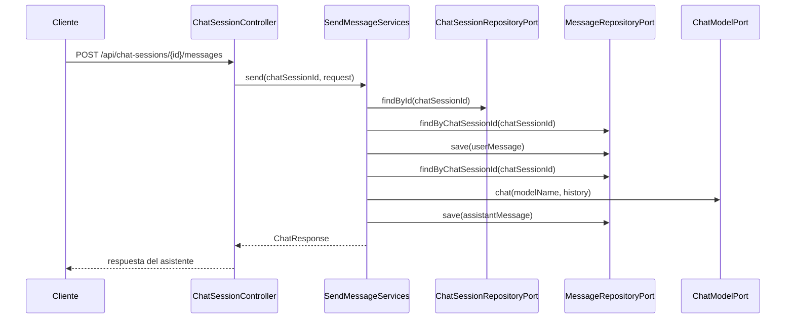

# ARCHITECTURE

## Vision general

`LLMGateway` implementa una API REST con autenticacion JWT y persistencia en PostgreSQL para servir como capa intermedia entre clientes y un modelo LLM ejecutado en Ollama.

La arquitectura sigue un estilo hexagonal ligero:

- `domain`: modelos y reglas basicas del negocio
- `application`: casos de uso y puertos
- `infrastructure`: controllers, adapters, repositorios, mappers y configuracion

## Diagrama de alto nivel

## Capas por modulo

### 1. Auth

Responsabilidad:

- registrar usuario
- autenticar credenciales
- emitir access token
- emitir o reutilizar refresh token
- revocar refresh token

Piezas clave:

- Entrada REST: [AuthController.java](/C:/Users/Carlos/Desktop/LLMGateway/src/main/java/com/fragua/LLMGateway/structure/auth/infrastructure/input/AuthController.java)
- Casos de uso: `LoginUserUseCase`, `RegisterUserUseCase`, `LogoutUserUseCase`, `CleanupRefreshTokensUseCase`
- Servicios: `LoginUserServices`, `RegisterUserServices`, `LogoutUserServices`, `CleanupRefreshTokensServices`
- Salidas: `JwtPort`, `PasswordEncoderPort`, `RefreshTokenRepositoryPort`

### 2. User

Responsabilidad:

- recuperar informacion del usuario autenticado
- resolver usuarios por email durante autenticacion

Piezas clave:

- Entrada REST: [UserController.java](/C:/Users/Carlos/Desktop/LLMGateway/src/main/java/com/fragua/LLMGateway/structure/user/infraestructure/input/UserController.java)
- Puerto: `UserRepositoryPort`
- Adapter JPA: `JpaUserRepositoryAdapter`

### 3. Chat Session

Responsabilidad:

- crear sesiones
- asociar una sesion a un usuario
- enviar mensajes a una sesion existente

Piezas clave:

- Entrada REST: [ChatSessionController.java](/C:/Users/Carlos/Desktop/LLMGateway/src/main/java/com/fragua/LLMGateway/structure/chatsession/infrastructure/adapter/input/ChatSessionController.java)
- Casos de uso: `CreateChatSessionUseCase`, `SendMessageUseCase`
- Servicios: `CreateChatSessionServices`, `SendMessageServices`
- Puerto: `ChatSessionRepositoryPort`

### 4. Message

Responsabilidad:

- persistir historial conversacional
- devolver mensajes ordenados por `messageOrder`

Piezas clave:

- Puerto: `MessageRepositoryPort`
- Adapter: `MessageAdapter`
- Repo JPA: `MessageRepository`

### 5. Ollama

Responsabilidad:

- adaptar el historial interno al formato requerido por Ollama
- invocar el endpoint remoto `/api/chat`

Piezas clave:

- Puerto: `ChatModelPort`
- Adapter: [OllamaAdapter.java](/C:/Users/Carlos/Desktop/LLMGateway/src/main/java/com/fragua/LLMGateway/structure/ollama/infrastructure/adapter/output/OllamaAdapter.java)
- Cliente Feign: [OllamaClient.java](/C:/Users/Carlos/Desktop/LLMGateway/src/main/java/com/fragua/LLMGateway/structure/ollama/infrastructure/adapter/output/client/OllamaClient.java)

### 6. Refresh Token

Responsabilidad:

- persistir refresh tokens
- validar expiracion
- soportar renovacion de access token

Piezas clave:

- Caso de uso: `RefreshTokenUseCase`
- Servicio: `RefreshTokenServices`
- Modelo: `RefreshTokenModel`

## Flujo de autenticacion

## Flujo de chat

## Modelo de datos principal

### User

- `id`
- `username`
- `email`
- `passwordHash`
- `enabled`
- timestamps

Relaciones:

- 1:N con `ChatSession`
- 1:N con `RefreshToken`

### ChatSession

- `id`
- `title`
- `modelName`
- `active`
- timestamps
- `user`

Relaciones:

- N:1 con `User`
- 1:N con `Message`

### Message

- `id`
- `role`
- `content`
- `promptTokens`
- `completionTokens`
- `totalTokens`
- `messageOrder`
- `createdAt`
- `chatSession`

### RefreshToken

- `id`
- `token`
- `revoked`
- `expiresAt`
- `createdAt`
- `user`

## Seguridad

La seguridad vive en [SecurityConfig.java](/C:/Users/Carlos/Desktop/LLMGateway/src/main/java/com/fragua/LLMGateway/structure/config/SecurityConfig.java) y [JwtAuthenticationFilter.java](/C:/Users/Carlos/Desktop/LLMGateway/src/main/java/com/fragua/LLMGateway/structure/config/JwtAuthenticationFilter.java).

Decisiones actuales:

- sesion stateless
- CSRF deshabilitado
- `/api/auth/**` publico
- resto de endpoints protegidos
- el `principal` autenticado se guarda como `UserModel`

## Configuracion externa

La aplicacion depende de:

- PostgreSQL local
- Ollama local o remoto
- propiedades JWT

Ubicacion:

- [application.yaml](/C:/Users/Carlos/Desktop/LLMGateway/src/main/resources/application.yaml)

## Limitaciones y decisiones pendientes

- No hay `@EnableScheduling`, por lo que la limpieza programada puede no ejecutarse.
- `RefreshTokenCleanupJob` existe, pero depende de que scheduling quede habilitado.
- El flujo de logout parece incompleto: se genera un objeto revocado, pero se persiste la referencia anterior.
- No hay capa explicita de excepciones HTTP.
- No hay observabilidad, metricas ni trazas distribuidas.
- No se ve versionado de API.

## Extension points

Las extensiones naturales del sistema son:

- nuevos proveedores LLM implementando `ChatModelPort`
- nuevos endpoints de consulta para historial y sesiones
- almacenamiento de metricas de tokens reales
- roles o permisos de usuario
- streaming de respuestas del modelo
